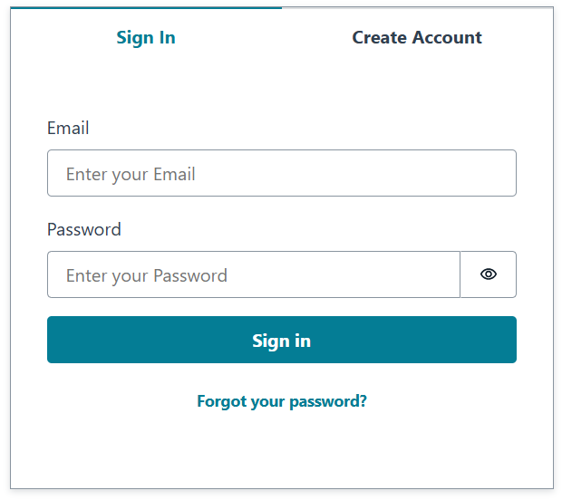
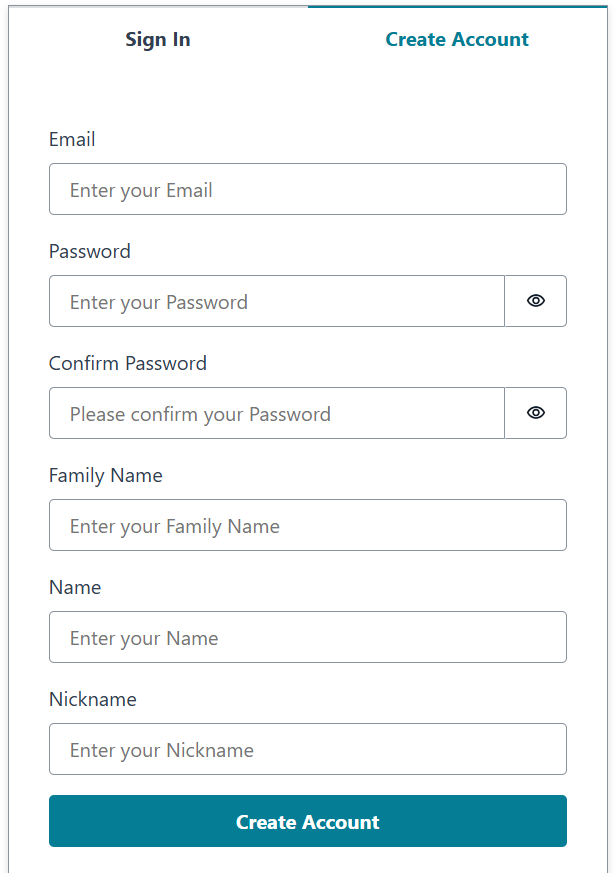
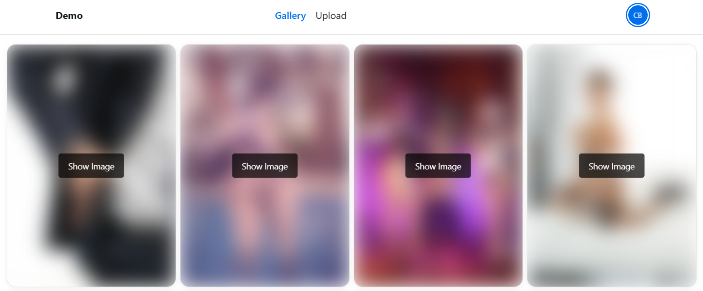

# Image Moderation System

## Overview

This project analyzes the content of uploaded images to ensure compliance with moderation policies using **AWS Rekognition**. If an image violates these policies, it will not be uploaded to the system. Accepted images are stored in **AWS S3**, and metadata such as the image path, creation date, and AWS Rekognition analysis results are saved in a **PostgreSQL** database. The system also provides a user-friendly interface for managing uploaded images and integrates with **AWS Cognito** for secure user authentication.

## Tech Stack

### Backend (API)

- **Framework**: Nest.js
- **Database**: PostgreSQL
- **ORM**: TypeORM
- **Cloud Services**:
  - AWS S3 (Storage)
  - AWS Rekognition (Image Moderation)
  - AWS Cognito (Authentication)
- **Language**: TypeScript
- **Libraries**:
  - `@aws-sdk/client-rekognition` (AWS Rekognition Integration)
  - `@aws-sdk/client-s3` (AWS S3 Integration)
  - `passport-jwt` (JWT Authentication)

### Frontend (UI)

- **Framework**: React
- **Build Tool**: Vite
- **Language**: TypeScript
- **Styling**: Tailwind CSS
- **Libraries**:
  - `axios` (HTTP Client)
  - `react-hook-form` (Form Management)
  - `react-toastify` (Notifications)
  - `zustand` (State Management)
  - `@aws-amplify/ui-react` (AWS Amplify Integration)
  - `react-icons` (Icons)
  - `@heroui/react` (UI Components)
  - `vitest` (Testing)

## User Authentication with AWS Cognito and Amplify

This project uses **AWS Cognito** for user authentication and **AWS Amplify** to integrate authentication into the frontend.

### AWS Cognito Setup

1. **Create a Cognito User Pool**:

   - Go to the [AWS Cognito Console](https://console.aws.amazon.com/cognito/).
   - Create a new User Pool and configure it with the desired settings (e.g., email as the username, password policies, etc.).
   - Note down the **User Pool ID** and **App Client ID**.

2. **Configure App Client**:

   - In the Cognito User Pool, create an App Client.
   - Enable the necessary authentication flows (e.g., `USER_PASSWORD_AUTH`).

3. **Set Up Domain**:
   - Configure a domain name for the User Pool under the "App Integration" section.

### AWS Amplify Setup

1. **Install Amplify CLI**:

   ```sh
   npm install -g @aws-amplify/cli
   ```

2. **Initialize Amplify**:

- Navigate to the `UI` directory:
  ```sh
  cd UI
  ```
- Run the following command:
  ```sh
  amplify init
  ```
- Follow the prompts to configure the Amplify project.

3. **Add Authentication**:
   ```sh
   amplify add auth
   ```

- Select "Default configuration" or customize as needed.
- Provide the Cognito User Pool details when prompted.

4. **Push Changes to AWS**:

   ```sh
   amplify push
   ```

5. **Update `aws-exports.js`**:
   - After pushing, Amplify generates an `aws-exports.js` file in the `src` directory.
   - Ensure this file is imported and used in `src/main.tsx` for Amplify configuration.

### Screenshots

**Login Page**



**Sign Up Page**



## Project Structure

```
API/
  ├── src/
  │   ├── application/
  │   │   └── post/
  │   │       ├── mapper/
  │   │       │   └── post.mapper.ts
  │   │       ├── models/
  │   │       │   └── post.model.ts
  │   │       ├── post.controller.ts
  │   │       ├── post.module.ts
  │   │       └── post.service.ts
  │   ├── domain/
  │   │   ├── constants/
  │   │   │   │── category-thresholds.constant.ts
  │   │   │   └── file.constant.ts
  │   │   ├── entities/
  │   │   │   └── post.entity.ts
  │   │   └── types/
  │   │       ├── hierarchy.type.ts
  │   │       └── status.type.ts
  │   ├── infrastructure/
  │   │   ├── auth/
  │   │   │   ├── auth.module.ts
  │   │   │   ├── jwt-auth.guard.ts
  │   │   │   ├── jwt.strategy.ts
  │   │   │   └── user.model.ts
  │   │   ├── aws/
  │   │   │   │── rekognition.service.ts
  │   │   │   └── s3.service.ts
  │   ├── shared/
  │   │   └── utils/
  │   │       └── moderation.util.ts
  │   ├── app.module.ts
  │   ├── config.ts
  │   └── main.ts
  ├── test/
  ├── .env
  ├── .eslintrc.js
  ├── .prettierrc
  ├── nest-cli.json
  ├── package.json
  ├── tsconfig.build.json
  └── tsconfig.json
UI/
  ├── src/
  │   ├── components/
  │   │   │── ImageModal/
  │   │   │── NavBar/
  │   │   │── ProtectedRoute/
  │   │   └── UserAccountDropdown/
  │   ├── config/
  │   │   └── constants.ts
  │   ├── hooks/
  │   │   │── useInfiniteScroll.ts
  │   │   │── useUserData.ts
  │   │   └── useUserStore.ts
  │   ├── interfaces/
  │   │   │── Pagination.ts
  │   │   │── Post.ts
  │   │   └── User.ts
  │   ├── layouts/
  │   │   └── MainLayout/
  │   ├── pages/
  │   │   │── AuthPage/
  │   │   │── GalleryPage/
  │   │   │── ProfilePage/
  │   │   └── UploadPage/
  │   ├── services/
  │   │   │── api/
  │   │   │   │── apiClient.ts
  │   │   │   └── requestInterceptor.ts
  │   │   └── postService.ts
  │   ├── utils/
  │   │   └── helpers.ts
  │   ├── App.css
  │   ├── App.tsx
  │   └── main.tsx
  ├── public/
  ├── .env
  ├── .gitignore
  ├── eslint.config.js
  ├── index.html
  ├── package.json
  ├── tsconfig.app.json
  ├── tsconfig.json
  ├── tsconfig.node.json
  └── vite.config.ts
```

## Setup and Installation

### Prerequisites

- Node.js (v20 or higher)
- npm or yarn
- PostgreSQL
- AWS Account with S3, Rekognition, and Cognito services enabled

### Backend (API)

1. Clone the repository:

   ```sh
   git clone https://github.com/cristofima/Demo-AWS-ImageModeration
   cd API
   ```

2. Install dependencies:

   ```sh
   npm install
   ```

3. Copy the `.env` file and rename it to `.env.local`:

   ```sh
   cp .env .env.local
   ```

4. Configure environment variables in `.env.local`:

   ```env
   DB_NAME=
   DB_USER=
   DB_PASSWORD=
   DB_HOST=

   COGNITO_APP_CLIENT_ID=
   COGNITO_APP_REGION=
   COGNITO_USER_POOL_ID=

   AWS_S3_ACCESS_KEY=
   AWS_S3_SECRET_ACCESS_KEY=
   AWS_S3_REGION=
   AWS_S3_BUCKET_NAME=
   AWS_S3_BUCKET_FOLDER=

   AWS_REKOGNITION_REGION=
   AWS_REKOGNITION_ACCESS_KEY=
   AWS_REKOGNITION_SECRET_ACCESS_KEY=
   ```

5. **Run the application**:
   ```sh
   npm run start:local
   ```

### Frontend (UI)

1. Navigate to the UI directory:

   ```sh
   cd ../UI
   ```

2. Install dependencies:

   ```sh
   npm install
   ```

3. Configure environment variables in `.env`:

   ```env
   REACT_APP_API_BASE_URL=http://localhost:3000/api
   ```

4. Run the application:
   ```sh
   npm run dev
   ```

## Image Moderation

The system classifies images into different categories based on AWS Rekognition's analysis. If an image is flagged as inappropriate, it will either be **blocked** or **blurred** before being stored.

### **Example of Accepted Images**

_(No offensive content)_


_(Mobile view)_


### **Example of Moderated Images (Blurred)**

_(Contains sensitive content, blurred for safety)_



_(Mobile view)_


## API Endpoints

### **Upload Image**

- **Endpoint:** `POST /api/Posts`
- **Description:** Uploads an image (Post), processes it with AWS Rekognition, and stores it if it passes moderation.
- **Request:**
  ```json
  {
    "image": "(binary file)"
  }
  ```
- **Response:**
  ```json
  {
    "id": 41,
    "imageIsBlurred": false,
    "createdAt": "2025-03-01T02:20:34.639Z",
    "createdBy": "user",
    "imagePath": "https://demo.s3.us-west-2.amazonaws.com/images/3.jpg"
  }
  ```

### **Get Images**

- **Endpoint:** `GET /api/Posts?page=1&limit=12`
- **Description:** Retrieves images (Posts) for the authenticated user.
- **Response:**
  ```json
  {
    "data": [
      {
        "id": 40,
        "imageIsBlurred": true,
        "createdAt": "2025-02-28T21:16:01.583Z",
        "createdBy": "user",
        "imagePath": "https://demo.s3.us-west-2.amazonaws.com/images/2.jpg"
      },
      {
        "id": 39,
        "imageIsBlurred": true,
        "createdAt": "2025-02-27T01:44:18.111Z",
        "createdBy": "user",
        "imagePath": "https://demo.s3.us-west-2.amazonaws.com/images/1.jpg"
      }
    ],
    "metadata": {
      "page": 1,
      "limit": 8,
      "totalRecords": 2,
      "totalPages": 1
    }
  }
  ```

## Author

Cristopher Coronado

## Contributing

If you wish to contribute, follow these steps:

1. Fork the repository.
2. Create a new branch: `git checkout -b feature-branch-name`
3. Commit your changes: `git commit -m "Added new feature"`
4. Push to the branch: `git push origin feature-branch-name`
5. Open a pull request.

## Acknowledgements

- [Nest.js](https://nestjs.com/)
- [React](https://reactjs.dev/)
- [TypeORM](https://typeorm.io/)
- [Vite](https://vitejs.dev/)
